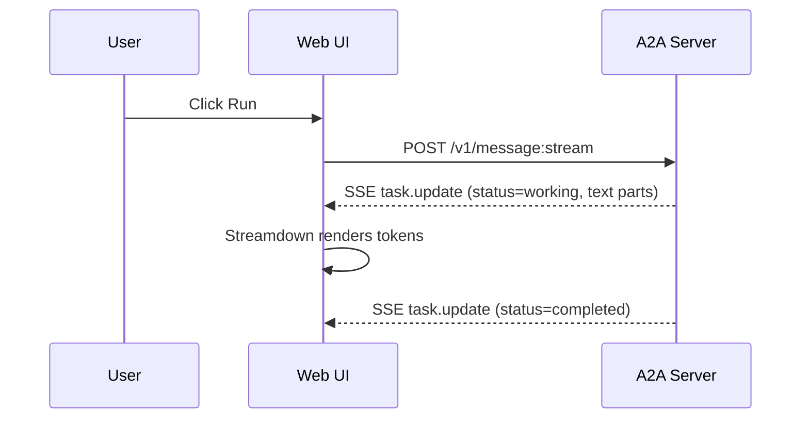
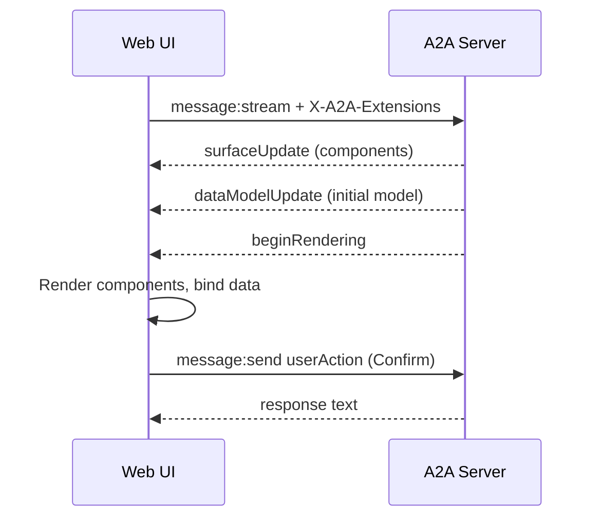
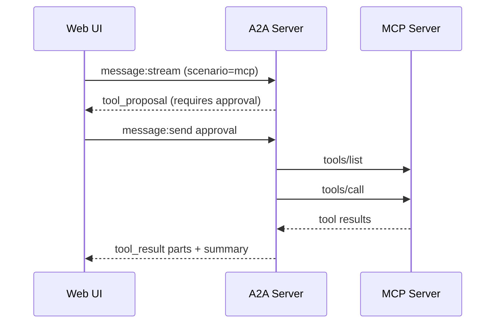
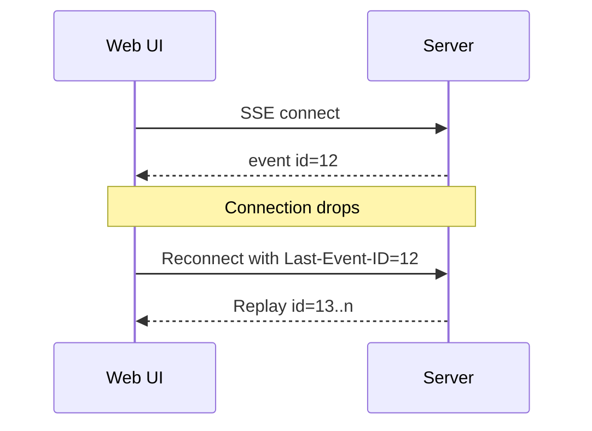
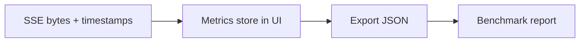
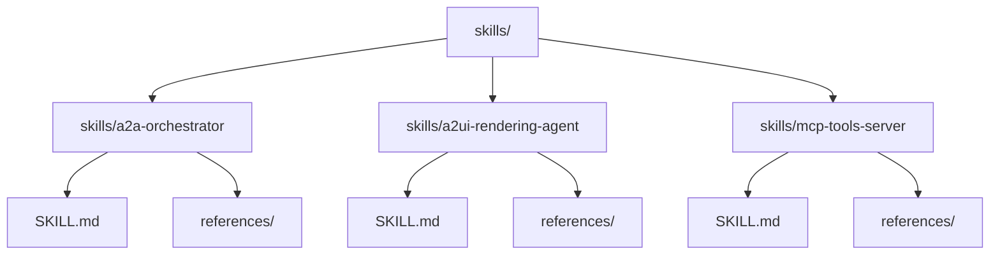

# Protocol Bakeoff Architecture (A2A vs MCP, A2UI vs Streamdown)

## 1) System Overview
Components
- Web UI (Next.js): scenario runner, Streamdown renderer, A2UI renderer, metrics tracker/export, tool approval UI, SSE client with resume.
- A2A Agent Server (.NET): A2A HTTP endpoints (message:send, message:stream, tasks:subscribe), SSE streaming, task store, A2UI extension, tool approval gate.
- MCP Tool Server (.NET): JSON-RPC tools/list and tools/call, Streamable HTTP + SSE resumability.
- Shared Types: JSON schemas and TS types for messages/metrics.
- AgentSkills: packaged skills for orchestrator, A2UI, MCP tools.

Key properties
- Task-oriented streaming via A2A.
- Tool orchestration via MCP with explicit approval.
- Structured UI via A2UI extension.
- Metrics export per run.

## 2) System Context Diagram
```mermaid
flowchart LR
  User((User)) --> UI[Web UI\nScenario Runner\nStreamdown + A2UI]
  UI <--> A2A[A2A Agent Server\nSSE + HTTP\nTask Store]
  A2A <--> MCP[MCP Tool Server\nJSON-RPC + SSE]
  A2A --> LLM[OpenRouter (optional)]
  UI --> MET[Metrics Export\nJSON per run]
```

## 3) Deployment / Ports
```
Browser (http://10.0.0.53:3000)
  |
  |  HTTP/SSE
  v
A2A Agent (http://localhost:5041)
  |
  |  JSON-RPC HTTP/SSE
  v
MCP Server (http://localhost:5040)

Optional: OpenRouter API over HTTPS
```

## 4) Core Message Models
A2A Part
- Exactly one of: text or file or data.
- Data parts can carry A2UI payloads.

A2UI Part inside A2A
- A2A data part with:
  - mimeType: application/json+a2ui
  - payload = one of:
    - beginRendering
    - surfaceUpdate
    - dataModelUpdate
    - deleteSurface

MCP JSON-RPC
- tools/list -> tool definitions + JSON Schema.
- tools/call -> content blocks (streamed or non-streamed).

## 5) Scenario A - A2A + Streamdown


Behavior
- TTFT captured on first token.
- Optional malformed Markdown + repair toggle.

## 6) Scenario B - A2A + A2UI


Rendering rules
- Render only after beginRendering.
- Separate component buffer + data model buffer.
- surfaceUpdate replaces by ID.
- dataModelUpdate uses adjacency list entries.

## 7) Scenario C - A2A Orchestrating MCP Tools


Tool safety
- UI displays tool name + args.
- Explicit approve/deny gate.
- Allowlist for network calls.

## 8) Resumability / Replay


Mechanics
- A2A: taskId + sequence resubscribe.
- MCP: Mcp-Session-Id + Last-Event-ID.

## 9) Metrics Pipeline


Metrics
- TTFT
- First-interactive latency
- Bytes received
- Approvals count
- Retries/resumes
- Errors

## 10) AgentSkills Packaging


## 11) Runtime Responsibilities
Web UI
- Connects to A2A SSE, parses task.update.
- Renders Streamdown or A2UI.
- Sends userAction / toolApproval via message:send.
- Exports metrics JSON.

A2A Agent
- Validates parts and A2UI payloads.
- Stores task events for replay.
- Emits ordered SSE events.
- Applies approval gate for tools.

MCP Server
- Validates JSON-RPC input.
- Executes tools/list and tools/call.
- Streams results + supports replay.

## 12) Security and Boundaries
- No secrets in code; use .env.
- Allowlisted HTTP tools.
- Explicit user approval for tools.
- CORS: open in Development, restricted in Production.
